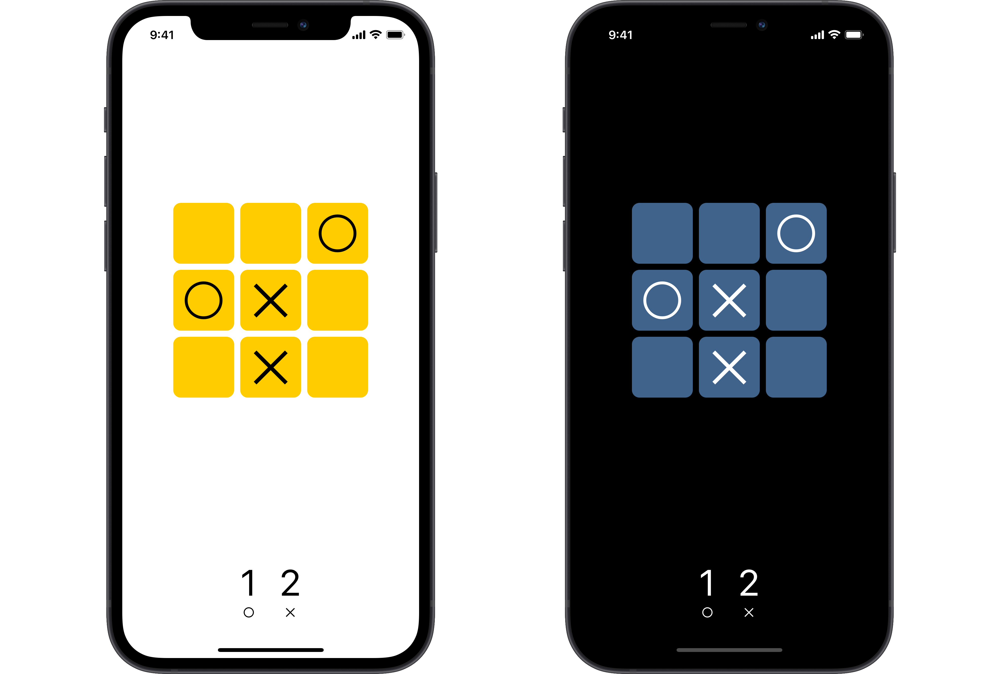

# TicTacToe

Crea una versión jugable del tres en raya para iOS.

## Requisitos

El interfaz de usuario deberá tener este aspecto:

El juego continua hasta que uno de los dos jugadores gana o haya empate, cuando se vuelve a empezar.

## Sugerencias

Los caracteres Unicode del ejemplo son `✕` y `○`.

## Restricciones

Utiliza SwiftUI para crear el diseño.

Desarrolla solo la orientación en vertical.

Da soporte al modo oscuro aplicando los colores adecuados.
